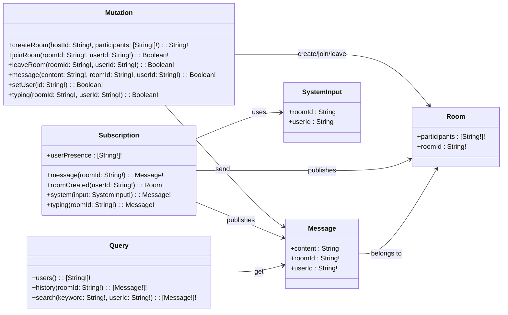
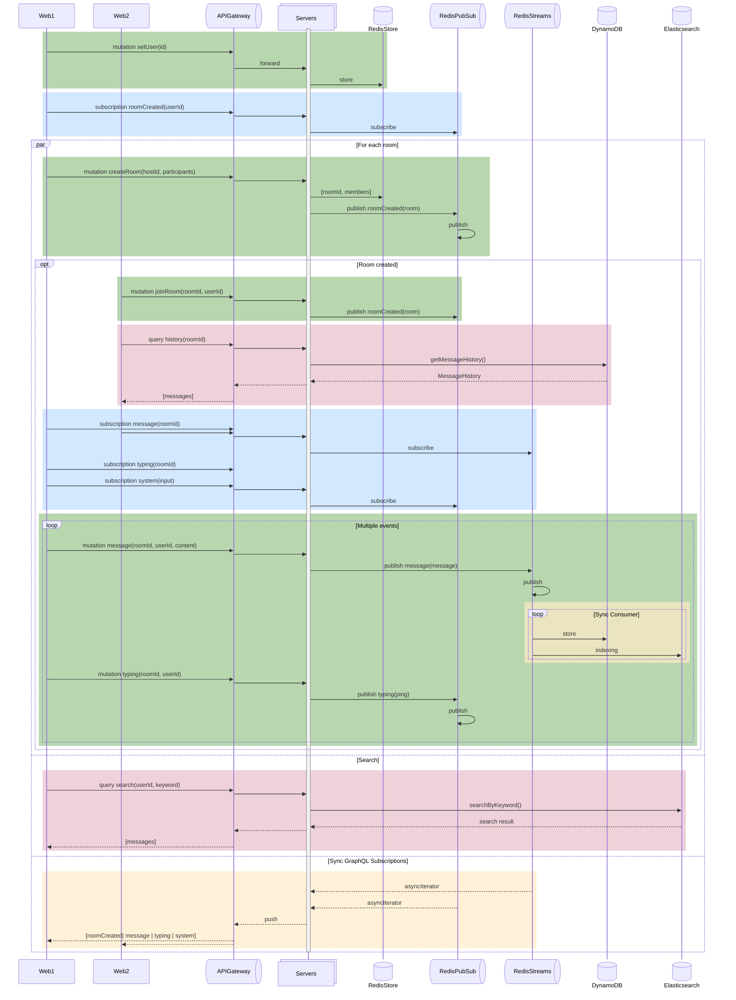

# GraphQL 채팅 서비스 백엔드

## 🛠️ 기술 스택

[](https://graphql.org/)  
[](https://nestjs.com/) [](https://www.apollographql.com/) [](https://nodejs.org/ko) [](https://www.typescriptlang.org/)  
[](https://redis.io) [](https://aws.amazon.com/ko/dynamodb/) [](https://www.elastic.co/kr/elasticsearch)  
[](https://eslint.org/) [](https://prettier.io/) [](https://github.com/APIs-guru/graphql-voyager)  
[![Docker Compose](https://img.shields.io/badge/Docker_Compose-2AB4FF.svg?logo=data:image/svg+xml;base64,PHN2ZyB4bWxucz0iaHR0cDovL3d3dy53My5vcmcvMjAwMC9zdmciIHZpZXdCb3g9IjAgMCA1MjMgNjY1Ij4KICA8cGF0aCBmaWxsPSIjZmNmY2ZjIiBmaWxsLXJ1bGU9ImV2ZW5vZGQiIGQ9Ik00MTggMWMtNiAxLTkgMy0xMyA4LTQgMy00IDMtMTAgMS0xMi02LTYwIDAtNjYgOC01IDYtMTEgNDQtOCA1MGwyMyAxN2M3IDQgNyA2IDIgNy0yMyAzLTM3IDI5LTI5IDUyIDMgOSAzIDktMTAgNi0xOS01LTI0LTYtNDUtNS00NyAwLTg2IDE4LTEwOSA1MGExMzUgMTM1IDAgMCAwLTI0IDY0Yy0zIDI4IDIgNDggMTcgNzJsMjIgMjdjNDAgNDQgNDEgNjYgMyA5MS00NSAzMC0xMDQgMTktMTA2LTIwLTEtMTYgNC0yOSAxNy01MiAxMy0yNCAxNC0zMyAzLTUybDEzLThjMjQtMTIgMjItOSAyMy0zNCAwLTIyIDItMjAtMjMtMzAtMTgtNi0yMC02LTQwLTEtMjggOS00MCAxNC00MSAxOCAwIDItMSAzLTIgMy03IDAtMTQgMTItMTUgMjUtMSAyMSA2IDI5IDMwIDM2IDMwIDkgMzUgMjQgMTkgNDktMzYgNTMtMzIgMTAyIDExIDEyMSAzNSAxNiA3NCAxMyAxMTktOWwxMS01IDMgMzJjMCAzNC00MCAzOC04OSA4bC0xNi0xMGMtNTEtMjktMTAyIDI0LTY2IDcwIDE1IDIwIDQyIDIxIDQ2IDIgMi04IDAtMTEtMTAtMTktMTYtMTItMTctMjQtMi0yNyA1LTEgMjYgOCAyOCAxMmwzNCAyOSAyMCAxMiAyMCA4YzM2IDEzIDgyLTE1IDgyLTUwIDAtMTAgMC0xMCA2LTUgMTAgMTAgMTggMTYgMjMgMTkgNiAzIDYgNCAxIDctNSAyLTUgMi01IDctMSA4IDEgMjkgNCAzMyA0IDcgNjMgNDYgNjkgNDYgMyAwIDQ4LTI1IDUxLTI5IDItMSAzLTM0IDEtMzZsLTE2LTljLTE2LTgtMTYtOC05LTEwIDE5LTcgMzctMjcgNDMtNDdsNS0xYTE2NSAxNjUgMCAwIDAgNjAtMTNjOSAwIDM0LTIyIDQwLTM0bDQtOGM0LTcgNi0yNiA2LTU2IDAtMjkgMS0yNy0xMC0yOS02LTItOC0zLTEzLTgtMzAtMjktNzktMjMtOTYgMTAtMyA3LTMgNy04IDlzLTYgNS01IDE3djE1YzEgMTQgNCAxNiAzNCAyOGwxMiA2YzcgMyA3IDMgMzAtNyA4LTMgOS0zIDkgMS02IDIyLTY0IDQyLTczIDI0YTg3IDg3IDAgMCAwLTYzLTQyYy04IDAtOCAwIDYtMTFhNzM2IDczNiAwIDAgMCA4NS04OWwzLTVjMTktMzEgMjEtNzMgMy0xMDctNy0xNS0yMy0zNS0zNi00OC0zOS0zNi00Ni00Ny0zOC02MiA0LTggMTUtMTcgMjAtMTVhNDUyIDQ1MiAwIDAgMCA1NS0xMmMxMS00IDEzLTUgMTQtMTAgMC00IDItNyA5LTE0IDI0LTI2LTgtODAtNDMtNzFNMjI4IDMzNGMxIDEgMCAxLTEgMS0yMCAwLTI4IDMyLTEyIDQyIDE3IDkgMzctMyAzNy0yMiAwLTctNy0xNy0xMS0xN3YtMWMzLTIgMC0zLTctNGwtNiAxbTU0IDgtNCAxYy0yMiAzLTI1IDM5LTMgNDQgMjQgNSA0MS0yMSAyNS0zOGwtNS0zdi0zYy0xLTItMTQtMy0xMy0xbS00OSAxMjBjLTYgNy05IDE0LTkgMjQgMCA4IDEgMTIgMyA2IDItMTIgOC0yOCAxMy0zM3YtM2MtMSAwLTQgMi03IDZtOTcgNGMwIDIgMjMgMTcgMjcgMTcgMiAwIDEtMy00LTctOS03LTIzLTEzLTIzLTEwbS01NCA2Yy0yMSA1MSAyOSA5NiA3MyA2NyA4LTYgOC03LTEtOC0zOS0zLTYzLTIzLTY2LTU0LTItMTItMy0xMy02LTUiLz4KPC9zdmc+Cg==&style=flat-square&logoColor=black)](https://docs.docker.com/compose/) [](https://www.docker.com/)

## 💡 주요 기능

| 기능 | 설명 | 쿼리(Query) / 요청(Mutation) | 구독(Subscription) |
| --- | --- | --- | --- |
| 사용자 등록 | 유저ID &harr; 소켓ID 매핑 | mutation setUser<br>(id: String!): Boolean! | subscription userPresence: [String!]! |
| 방 생성 | 방 객체 생성 &rarr;<br> 참가자 초대 이벤트 발생 | mutation createRoom<br>(hostId: String!, participants: [String!]!): String! | subscription roomCreated<br>(userId: String!): Room! |
| 방 참가 | 방에 사용자 추가 &rarr;<br> 참가자 초대 이벤트 발생 | mutation joinRoom<br>(roomId: String!, userId: String!): Boolean! | subscription roomCreated<br>(userId: String!): Room! |
| 방 떠나기 | 방에서 사용자 제거 &rarr;<br> 떠남 알림 | mutation leaveRoom<br>(roomId: String!, userId: String!): Boolean! | subscription system<br>(input: SystemInput!): Message! |
| 메시지 교환 | 방에서 메시지 중계 | mutation message<br>(content: String!, roomId: String!, userId: String!):<br> Boolean! | subscription message<br>(roomId: String!): Message! |
| 타이핑 알림 | 방에서 타이핑 이벤트 중계 | mutation typing<br>(roomId: String!, userId: String!): Boolean! | subscription typing<br>(roomId: String!): Message! |
| 메시지 기록 <br>불러오기 | 방 참가 전 메시지 기록 불러오기 | query history(roomId: String!): [Message!]! |  |
| 메시지 검색 | 키워드로 메시지 기록 불러오기 | query search<br>(keyword: String!, userId: String!): [Message!]! |  |

## 🛰️ GraphQL Schema Diagram

> GraphQL Voyager는 GraphQL 스키마를 시각적으로 탐색하고 구조를 이해할 수 있도록 돕는 정적/인터랙티브 시각화 도구  
> 타입과 타입 간 참조를 그래프 형태로 표현

| [](https://narcisource.github.io/Chat-Service--Backend/) |
| --- |
| [GraphQL Voyager 바로가기](https://narcisource.github.io/Chat-Service--Backend/) |



## 📐 Sequence Diagram



## 📂 폴더 구조

<details>
<summary>열기</summary>

```
server
├─ .env
├─ docs
│  └─ index.html
├─ graphql
│  └─ schema.gql
├─ src
│  ├─ main.ts
│  ├─ common
│  │  ├─ graphql
│  │  │  ├─ index.ts
│  │  │  └─ module.ts
│  │  ├─ redis
│  │  │  ├─ index.ts
│  │  │  ├─ module.ts
│  │  │  └─ providers
│  │  │     ├─ index.ts
│  │  │     ├─ storage.ts
│  │  │     ├─ pubsub.ts
│  │  │     └─ streams.ts
│  │  ├─ dynamo
│  │  │  ├─ index.ts
│  │  │  ├─ module.ts
│  │  │  └─ provider.ts
│  │  ├─ es
│  │  │  ├─ index.ts
│  │  │  ├─ module.ts
│  │  │  └─ provider.ts
│  │  └─ symbols.ts
│  ├─ model
│  │  ├─ Message.ts
│  │  ├─ Room.ts
│  │  └─ schemaDefinition.ts
│  ├─ core
│  │  ├─ controller.ts
│  │  └─ module.ts
│  ├─ domain
│  │  ├─ shared
│  │  │  └─ events
│  │  │     ├─ index.ts
│  │  │     ├─ PubSubPublish.event.ts
│  │  │     ├─ PubSubPublish.handler.ts
│  │  │     ├─ StreamsPublish.event.ts
│  │  │     └─ StreamsPublish.handler.ts
│  │  ├─ user
│  │  │  ├─ index.ts
│  │  │  ├─ module.ts
│  │  │  ├─ model.ts
│  │  │  ├─ queries
│  │  │  │  ├─ index.ts
│  │  │  │  └─ GetUsers.query.ts
│  │  │  │     └─ GetUsers.handler.ts
│  │  │  ├─ commands
│  │  │  │  ├─ index.ts
│  │  │  │  ├─ DisconnectUser.command.ts
│  │  │  │  │  └─ DisconnectUser.handler.ts
│  │  │  │  └─ RegisterUser.command.ts
│  │  │  │     └─ RegisterUser.handler.ts
│  │  │  └─ resolvers
│  │  │     ├─ index.ts
│  │  │     ├─ query.ts
│  │  │     ├─ mutation.ts
│  │  │     └─ subscription.ts
│  │  ├─ chat
│  │  │  ├─ index.ts
│  │  │  ├─ model.ts
│  │  │  ├─ module.ts
│  │  │  ├─ queries
│  │  │  │  ├─ index.ts
│  │  │  │  ├─ GetMessageHistory.query.ts
│  │  │  │  │  └─ GetMessageHistory.handler.ts
│  │  │  │  ├─ GetPartitions.query.ts
│  │  │  │  │  └─ GetPartitions.handler.ts
│  │  │  │  └─ SearchMessages.query.ts
│  │  │  │     └─ SearchMessages.handler.ts
│  │  │  └─ resolvers
│  │  │     ├─ index.ts
│  │  │     ├─ query.ts
│  │  │     ├─ mutation.ts
│  │  │     └─ subscription.ts
│  │  └─ room
│  │     ├─ index.ts
│  │     ├─ model.ts
│  │     ├─ module.ts
│  │     ├─ quires
│  │     │  ├─ index.ts
│  │     │  └─ GetRoomsByUser.query.ts
│  │     │     └─ GetRoomsByUser.handler.ts
│  │     ├─ commands
│  │     │  ├─ index.ts
│  │     │  ├─ CreateRoom.command.ts
│  │     │  │  └─ CreateRoom.handler.ts
│  │     │  ├─ JoinRoom.command.ts
│  │     │  │  └─ JoinRoom.handler.ts
│  │     │  └─ LeaveRoom.command.ts
│  │     │     └─ LeaveRoom.handler.ts
│  │     └─ resolvers
│  │        ├─ index.ts
│  │        ├─ mutation.ts
│  │        └─ subscription.ts
│  └─ repository
│     ├─ index.ts
│     ├─ module.ts
│     └─ interface.ts
│        ├─ InMemoryRepository.ts
│        └─ DatabaseRepository.ts
├─ Dockerfile
│  └─ .dockerignore
├─ nest-cli.json
├─ codegen.introspection.yml # graphQL 스키마 생성 정의
├─ package.json
│  └─ package-lock.json
├─ tsconfig.json
│  └─ tsconfig.build.json
└─ eslint.config.mjs
   └─ .prettierrc
```

</details>

## 🚀 실행 방법

```sh
$ docker run -d \
  --name redis-container \
  --env-file ./.env \
  -p ${REDIS_PORT}:6379 \
  redis:8.2.1

$ docker run -d \
  --name dynamodb-container \
  --env-file ./.env \
  -p ${DYNAMO_PORT}:8000 \
  amazon/dynamodb-local:3.1.0

$ docker run -d \
  --name es-container \
  --env-file .env \
  -p ${ES_PORT}:9200 \
  docker.elastic.co/elasticsearch/elasticsearch:9.2.0

$ docker build \
  -f Dockerfile \
  -t chat/server:latest \
  .

$ docker run -d \
  --name chat/server \
  --env-file .env \
  -p 3000:3000
  chat/server:latest
```

## 🖥️ 접속 안내

| 환경               | URL                              |
| ------------------ | -------------------------------- |
| server healthcheck | <http://localhost:3000>          |
| graphql schema     | <http://localhost:3000/voyager>⁠ |
| graphql playground | <http://localhost:3000/graphql>⁠ |
