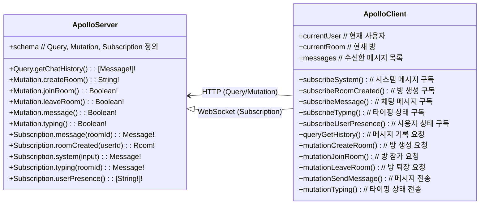
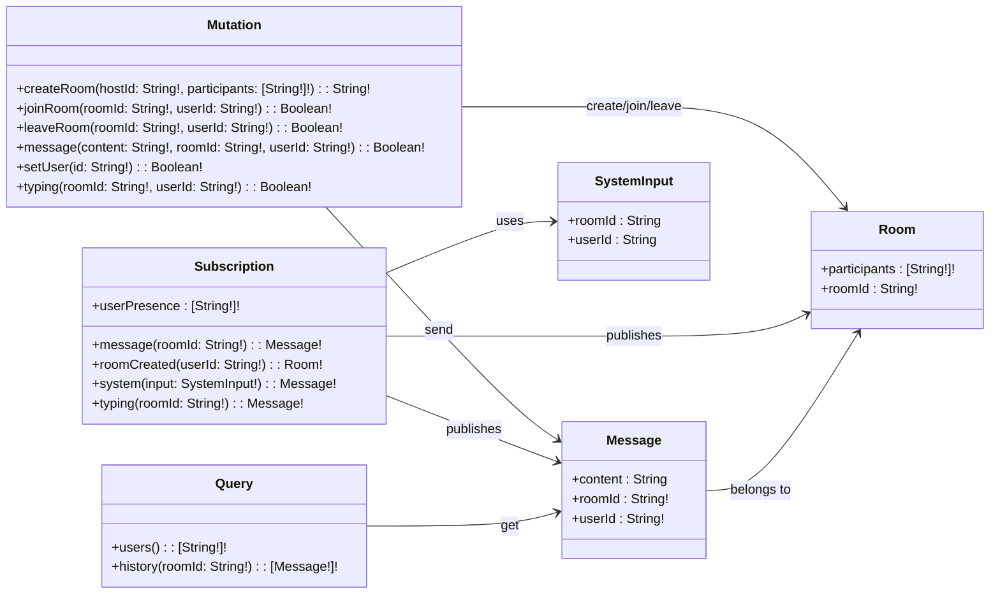

# GraphQL 채팅 서비스

## 🚩 목차

- [🛠️ 기술 스택](#️-기술-스택)
- [💁 소개](#-소개)
- [🎥 데모](#-데모)
- [💡 주요 기능](#-주요-기능)
- [📊 다이어그램](#-다이어그램)
  - [🏗️ Architecture Diagram](#️-architecture-diagram)
  - [📡 Communication Diagram](#-communication-diagram)
  - [🛰️ GraphQL Schema Diagram](#️-graphql-schema-diagram)
- [📂 폴더 구조](#-폴더-구조)
- [🗂️ 서브 프로젝트](#%EF%B8%8F-서브-프로젝트)
- [🚀 실행 방법](#-실행-방법)

## 🛠️ 기술 스택

[](https://graphql.org/)
[](https://www.apollographql.com/)  
[](https://nestjs.com/)
[](https://expressjs.com/ko/)
[](https://nodejs.org/ko)
[](https://www.typescriptlang.org/)  
[](https://redis.io)
[](https://aws.amazon.com/ko/dynamodb/)  
[](https://vuejs.org/)
[](https://ko.vite.dev)
[](https://pinia.vuejs.org/)
[](https://quasar.dev/)  
[![Steiger](https://img.shields.io/badge/FSD_Steiger-211b1d.svg?logo=data:image/svg+xml;base64,PD94bWwgdmVyc2lvbj0iMS4wIiBlbmNvZGluZz0iVVRGLTgiPz4KPHN2ZyB2ZXJzaW9uPSIxLjEiIHhtbG5zPSJodHRwOi8vd3d3LnczLm9yZy8yMDAwL3N2ZyIgd2lkdGg9IjIwMCIgaGVpZ2h0PSIyMDAiPgo8cGF0aCBkPSJNMCAwIEMyOC4zOCAwIDU2Ljc2IDAgODYgMCBDODYgMy42MyA4NiA3LjI2IDg2IDExIEM1Ny42MiAxMSAyOS4yNCAxMSAwIDExIEMwIDcuMzcgMCAzLjc0IDAgMCBaICIgZmlsbD0iI0VCRUFFQSIgdHJhbnNmb3JtPSJ0cmFuc2xhdGUoNTcsMTAyKSIvPgo8cGF0aCBkPSJNMCAwIEMyOC4zOCAwIDU2Ljc2IDAgODYgMCBDODYgMy42MyA4NiA3LjI2IDg2IDExIEM1Ny42MiAxMSAyOS4yNCAxMSAwIDExIEMwIDcuMzcgMCAzLjc0IDAgMCBaICIgZmlsbD0iI0VCRUFFQSIgdHJhbnNmb3JtPSJ0cmFuc2xhdGUoNTcsODcpIi8+CjxwYXRoIGQ9Ik0wIDAgQzI4LjM4IDAgNTYuNzYgMCA4NiAwIEM4NiAzLjYzIDg2IDcuMjYgODYgMTEgQzU3LjYyIDExIDI5LjI0IDExIDAgMTEgQzAgNy4zNyAwIDMuNzQgMCAwIFogIiBmaWxsPSIjRUJFQUVBIiB0cmFuc2Zvcm09InRyYW5zbGF0ZSg1Nyw1NykiLz4KPHBhdGggZD0iTTAgMCBDMjguMzggMCA1Ni43NiAwIDg2IDAgQzg2IDMuNjMgODYgNy4yNiA4NiAxMSBDNTcuNjIgMTEgMjkuMjQgMTEgMCAxMSBDMCA3LjM3IDAgMy43NCAwIDAgWiAiIGZpbGw9IiNFQkVBRUEiIHRyYW5zZm9ybT0idHJhbnNsYXRlKDU3LDQyKSIvPgo8cGF0aCBkPSJNMCAwIEMxMy41MyAwIDI3LjA2IDAgNDEgMCBDNDEgMy42MyA0MSA3LjI2IDQxIDExIEMyNy40NyAxMSAxMy45NCAxMSAwIDExIEMwIDcuMzcgMCAzLjc0IDAgMCBaICIgZmlsbD0iI0U5RThFOCIgdHJhbnNmb3JtPSJ0cmFuc2xhdGUoNTcsMTQ3KSIvPgo8cGF0aCBkPSJNMCAwIEMxMy41MyAwIDI3LjA2IDAgNDEgMCBDNDEgMy42MyA0MSA3LjI2IDQxIDExIEMyNy40NyAxMSAxMy45NCAxMSAwIDExIEMwIDcuMzcgMCAzLjc0IDAgMCBaICIgZmlsbD0iI0U5RThFOCIgdHJhbnNmb3JtPSJ0cmFuc2xhdGUoNTcsMTMyKSIvPgo8cGF0aCBkPSJNMCAwIEMxMy41MyAwIDI3LjA2IDAgNDEgMCBDNDEgMy42MyA0MSA3LjI2IDQxIDExIEMyNy40NyAxMSAxMy45NCAxMSAwIDExIEMwIDcuMzcgMCAzLjc0IDAgMCBaICIgZmlsbD0iI0U5RThFOCIgdHJhbnNmb3JtPSJ0cmFuc2xhdGUoNTcsMTE3KSIvPgo8cGF0aCBkPSJNMCAwIEMxMy41MyAwIDI3LjA2IDAgNDEgMCBDNDEgMy42MyA0MSA3LjI2IDQxIDExIEMyNy40NyAxMSAxMy45NCAxMSAwIDExIEMwIDcuMzcgMCAzLjc0IDAgMCBaICIgZmlsbD0iI0U5RThFOCIgdHJhbnNmb3JtPSJ0cmFuc2xhdGUoNTcsNzIpIi8+Cjwvc3ZnPgo=&style=flat-square&logoColor=black)](https://github.com/feature-sliced/steiger)
[](https://eslint.org/)
[](https://prettier.io/)  
[](https://vitest.dev/)
[](https://typedoc.org/)
[](https://www.postman.com/)
[](https://github.com/APIs-guru/graphql-voyager)  
[![Docker Compose](https://img.shields.io/badge/Docker_Compose-2AB4FF.svg?logo=data:image/svg+xml;base64,PHN2ZyB4bWxucz0iaHR0cDovL3d3dy53My5vcmcvMjAwMC9zdmciIHZpZXdCb3g9IjAgMCA1MjMgNjY1Ij4KICA8cGF0aCBmaWxsPSIjZmNmY2ZjIiBmaWxsLXJ1bGU9ImV2ZW5vZGQiIGQ9Ik00MTggMWMtNiAxLTkgMy0xMyA4LTQgMy00IDMtMTAgMS0xMi02LTYwIDAtNjYgOC01IDYtMTEgNDQtOCA1MGwyMyAxN2M3IDQgNyA2IDIgNy0yMyAzLTM3IDI5LTI5IDUyIDMgOSAzIDktMTAgNi0xOS01LTI0LTYtNDUtNS00NyAwLTg2IDE4LTEwOSA1MGExMzUgMTM1IDAgMCAwLTI0IDY0Yy0zIDI4IDIgNDggMTcgNzJsMjIgMjdjNDAgNDQgNDEgNjYgMyA5MS00NSAzMC0xMDQgMTktMTA2LTIwLTEtMTYgNC0yOSAxNy01MiAxMy0yNCAxNC0zMyAzLTUybDEzLThjMjQtMTIgMjItOSAyMy0zNCAwLTIyIDItMjAtMjMtMzAtMTgtNi0yMC02LTQwLTEtMjggOS00MCAxNC00MSAxOCAwIDItMSAzLTIgMy03IDAtMTQgMTItMTUgMjUtMSAyMSA2IDI5IDMwIDM2IDMwIDkgMzUgMjQgMTkgNDktMzYgNTMtMzIgMTAyIDExIDEyMSAzNSAxNiA3NCAxMyAxMTktOWwxMS01IDMgMzJjMCAzNC00MCAzOC04OSA4bC0xNi0xMGMtNTEtMjktMTAyIDI0LTY2IDcwIDE1IDIwIDQyIDIxIDQ2IDIgMi04IDAtMTEtMTAtMTktMTYtMTItMTctMjQtMi0yNyA1LTEgMjYgOCAyOCAxMmwzNCAyOSAyMCAxMiAyMCA4YzM2IDEzIDgyLTE1IDgyLTUwIDAtMTAgMC0xMCA2LTUgMTAgMTAgMTggMTYgMjMgMTkgNiAzIDYgNCAxIDctNSAyLTUgMi01IDctMSA4IDEgMjkgNCAzMyA0IDcgNjMgNDYgNjkgNDYgMyAwIDQ4LTI1IDUxLTI5IDItMSAzLTM0IDEtMzZsLTE2LTljLTE2LTgtMTYtOC05LTEwIDE5LTcgMzctMjcgNDMtNDdsNS0xYTE2NSAxNjUgMCAwIDAgNjAtMTNjOSAwIDM0LTIyIDQwLTM0bDQtOGM0LTcgNi0yNiA2LTU2IDAtMjkgMS0yNy0xMC0yOS02LTItOC0zLTEzLTgtMzAtMjktNzktMjMtOTYgMTAtMyA3LTMgNy04IDlzLTYgNS01IDE3djE1YzEgMTQgNCAxNiAzNCAyOGwxMiA2YzcgMyA3IDMgMzAtNyA4LTMgOS0zIDkgMS02IDIyLTY0IDQyLTczIDI0YTg3IDg3IDAgMCAwLTYzLTQyYy04IDAtOCAwIDYtMTFhNzM2IDczNiAwIDAgMCA4NS04OWwzLTVjMTktMzEgMjEtNzMgMy0xMDctNy0xNS0yMy0zNS0zNi00OC0zOS0zNi00Ni00Ny0zOC02MiA0LTggMTUtMTcgMjAtMTVhNDUyIDQ1MiAwIDAgMCA1NS0xMmMxMS00IDEzLTUgMTQtMTAgMC00IDItNyA5LTE0IDI0LTI2LTgtODAtNDMtNzFNMjI4IDMzNGMxIDEgMCAxLTEgMS0yMCAwLTI4IDMyLTEyIDQyIDE3IDkgMzctMyAzNy0yMiAwLTctNy0xNy0xMS0xN3YtMWMzLTIgMC0zLTctNGwtNiAxbTU0IDgtNCAxYy0yMiAzLTI1IDM5LTMgNDQgMjQgNSA0MS0yMSAyNS0zOGwtNS0zdi0zYy0xLTItMTQtMy0xMy0xbS00OSAxMjBjLTYgNy05IDE0LTkgMjQgMCA4IDEgMTIgMyA2IDItMTIgOC0yOCAxMy0zM3YtM2MtMSAwLTQgMi03IDZtOTcgNGMwIDIgMjMgMTcgMjcgMTcgMiAwIDEtMy00LTctOS03LTIzLTEzLTIzLTEwbS01NCA2Yy0yMSA1MSAyOSA5NiA3MyA2NyA4LTYgOC03LTEtOC0zOS0zLTYzLTIzLTY2LTU0LTItMTItMy0xMy02LTUiLz4KPC9zdmc+Cg==&style=flat-square&logoColor=black)](https://docs.docker.com/compose/)
[](https://www.docker.com/)
[](https://konghq.com/ko-kr)
[](https://nginx.org/)

## 💁 소개

**GraphQL**를 활용한 실시간 다대다 채팅 서비스입니다.

사용자는 채팅 방을 생성하고, 다른 사용자와 동시에 메시지를 주고받으며,  
타이핑 상태 알림으로 대화 몰입도를 높일 수 있습니다.  
모든 메시지와 이벤트는 **Redis**에 저장 후 즉시 소비되어, 초저지연 실시간 통신을 제공합니다.

또한, 처리된 메시지와 이벤트는 **DynamoDB**에 영구 저장되어  
필요 시 애플리케이션에서 이전 대화 내역이나 상태를 조회할 수 있습니다.  
이를 통해 실시간성과 데이터 영속성을 모두 만족합니다.

## 🎥 데모

https://github.com/user-attachments/assets/33a33082-bac5-4f8f-bbcf-1c338ebad78e

## 💡 주요 기능

| 주요 기능                        | 내용                                                                               |
| -------------------------------- | ---------------------------------------------------------------------------------- |
| **WebSocket**을 통한 실시간 채팅 | WebSocket을 사용하여 사용자 간에 실시간으로 채팅할 수 있습니다.                    |
| 다대다 채팅 기능                 | 여러 사용자가 동시에 참여하여 채팅을 진행할 수 있는 다대다 채팅 기능을 제공합니다. |
| 채팅 방 생성 및 삭제             | 사용자가 새로운 채팅 방을 생성하고, 필요에 따라 방을 삭제할 수 있습니다.           |
| 채팅 방 내 사용자 추가           | 채팅 방 생성 후, 다른 사용자를 해당 방에 추가할 수 있는 기능을 제공합니다.         |
| 입력 타이핑 상태 표시            | 사용자가 타이핑 중일 때 다른 사용자에게 그 상태를 실시간으로 표시해줍니다.         |
| 채팅방 내용 키워드 검색          | 채팅방 내의 메시지를 키워드를 통해 쉽게 검색할 수 있는 기능을 제공합니다.          |
| 채팅 대화 디스크 저장            | 모든 채팅 내용을 디스크에 저장하여 나중에 다시 볼 수 있게 합니다.                  |

## 📊 다이어그램

### 🏗️ Architecture Diagram


- 백엔드
  - **Apollo Server**: Express 플러그인으로 GraphQL Query / Mutation / Subscription / Resolver 처리
  - **Kong API Gateway**: 클라이언트 요청 라우팅 및 로드밸런싱, WebSocket 업그레이드 지원
  - **NestJS 서버**: 이벤트 처리, 비즈니스 로직 실행
  - **Business**: 클라이언트 요청 처리, 레플리카 간 **Redis Adapter**를 통해 세션 동기화
  - **Redis**
    - **Pub/Sub**: 서버 레플리카 간 메시지 동기화
    - **Streams**: 레디스 스트림에 메시지 저장 후 소비
    - **Storage**: 캐싱 및 데이터 저장소 역할
  - **DynamoDB**: Redis Streams에서 전달된 이벤트 데이터를 영구 저장
- 프론트엔드
  - **Apollo Client**: GraphQL Query/Mutation/Subscription 처리, 클라이언트 캐싱, 데이터 페칭
  - **NGINX**: 프론트엔드 애플리케이션 정적 파일 서빙
  - **Vue**: UI 렌더링 및 상태 관리
  - **Quasar**: 웹 UI 구성 및 스타일링
- 데이터 흐름
  1. 클라이언트(Vue)에서 Apollo Client로 GraphQL Query / Mutation / Subscription 요청 전송
  2. Kong API Gateway가 WebSocket 업그레이드를 처리하고 요청을 NestJS 서버 레플리카로 전달
  3. Apollo Server + NestJS에서 요청 처리 후 비즈니스 로직 실행
     - Query / Mutation: 비즈니스 로직 실행 후 응답 반환
     - Subscription: Redis Pub/Sub를 통해 실시간 이벤트 브로드캐스트
     - Redis Storage에서 데이터 조회/저장
  4. Consumer가 이벤트를 읽어 DynamoDB에 데이터 저장
  5. 클라이언트는 Subscription을 구독하고, 서버에서 발행된 메시지를 실시간 수신
  6. 화면에 실시간 업데이트 (채팅 메시지, 타이핑 상태, 방 생성)

### 📡 Communication Diagram



### 🛰️ GraphQL Schema Diagram

> GraphQL Voyager는 GraphQL 스키마를 시각적으로 탐색하고 구조를 이해할 수 있도록 돕는 정적/인터랙티브 시각화 도구  
> 타입과 타입 간 참조를 그래프 형태로 표현

| [](https://narcisource.github.io/Chat-Service--Backend/) |
| --------------------------------------------------------------------------------------------------------------------------------------------------- |
| [GraphQL Voyager](https://narcisource.github.io/Chat-Service--Backend/)                                                                             |



## 📂 폴더 구조

<details>
<summary>열기</summary>

```
Chat-Service
├─ infra
│  └─ docker-compose.yml
├─ project
│  ├─ client
│  │  ├─ Dockerfile
│  │  ├─ nginx.conf
│  │  └─ codegen.yml
│  ├─ server
│  │  ├─ Dockerfile
│  │  └─ graphql
│  │     └─ schema.gql
│  └─ consumers
│     ├─ stream-dynamo-consumer
│     │  └─ Dockerfile
│     └─ docker-compose.yml
├─ .env
├─ .prettierrc
├─ docker-compose.yml
└─ README.md
```

</details>

## 🗂️ 서브 프로젝트

| 프로젝트               | 저장소                                                                            | 설명                                  | 브랜치/버전       |
| ---------------------- | --------------------------------------------------------------------------------- | ------------------------------------- | ----------------- |
| Backend                | https://github.com/NarciSource/Chat-Service--Backend/tree/graphql                 | GraphQL + Redis 기반 실시간 채팅 서버 | graphql / v2.2.0  |
| Frontend               | https://github.com/NarciSource/Chat-Service--Frontend/tree/graphql                | Vue + Vite 클라이언트                 | graphql / v2.1.0  |
| stream-dynamo-consumer | https://github.com/NarciSource/Chat-GraphQL/tree/consumers/stream-dynamo-consumer | Redis-Streams에서 DynamoDB로 동기화   | consumer / v1.1.0 |

## 🚀 실행 방법

```sh
$ git clone https://github.com/NarciSource/Chat-GraphQL.git

$ cd Chat-GraphQL

$ docker-compose up -d
```

## 🖥️ 접속 안내

| 환경                 | URL                              |
| -------------------- | -------------------------------- |
| web                  | <http://localhost:80>            |
| server healthcheck   | <http://localhost:3000>          |
| graphql schema       | <http://localhost:3000/voyager>⁠ |
| graphql playground   | <http://localhost:3000/graphql>⁠ |
| api gateway 대시보드 | <http://localhost:3002>          |
